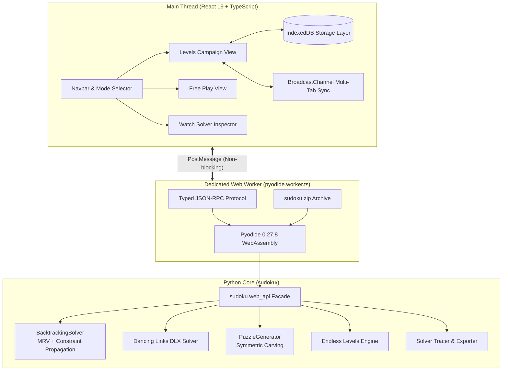

# Sudoku Engine & Interactive Web Application

A zero-backend, client-side Sudoku web application and Python library featuring:
- **Python Single Source of Truth**: The full standard-library Python core runs inside the browser via **Pyodide (WebAssembly)** inside a dedicated Web Worker. Zero JavaScript reimplementation of the solver.
- **Three Full Game Modes**:
  1. **Endless Campaign (Levels)**: Auto-generated endless campaign (10 levels per world, symmetric boss levels at index 10, 1–3 star ratings, par times, prefetching, persistent progress in IndexedDB, multi-tab sync). Default landing mode.
  2. **Free Play**: Player-solved puzzles with selectable difficulties (`beginner`, `easy`, `medium`, `hard`, `expert`), custom seeds, pencil notes (`N`), live conflict detection, logical hint system, and undo/redo history.
  3. **Watch Solver**: Visual step-by-step logic inspector demonstrating *how* the solver works (live 3×3 candidate grids, decision search tree, branch/backtrack scrubber, plain-English deduction explanations, and a side-by-side comparison modal with naive brute-force backtracking).
- **100% Self-Hosted & Offline Capable (PWA)**: Pinned Pyodide 0.27.8 assets are served locally from `public/pyodide/` without runtime external CDN dependencies. Fully installable PWA with offline Service Worker.
- **Strict Verification & Determinism**: Property-based tests (Hypothesis), Knuth's Dancing Links (DLX) reference solver cross-validation, and bit-for-bit determinism between CPython and in-browser Pyodide across golden benchmarks and campaign levels.

---

## Architecture



---

## How to Run

### Prerequisites
- **Python**: 3.11+ (Python 3.12+ recommended)
- **Node.js**: 20+ (Node.js 22 recommended)
- **npm**: 10+

---

### 1. Interactive Web Application

#### Option A: Quickstart (Development Mode)
```bash
# 1. Install frontend dependencies
cd frontend
npm install

# 2. Package the Python core and launch the Vite dev server
npm run dev
```
Open **[http://localhost:5173](http://localhost:5173)** in your browser.

#### Option B: Production Build & Local Preview
```bash
# 1. Build the production bundle (packages Python core + builds static assets)
cd frontend
npm run build

# 2. Preview the static output locally
npm run preview
```
Open **[http://localhost:4173](http://localhost:4173)** in your browser.

---

### 2. Python CLI & Terminal Solver

Install the Python package locally in editable mode:
```bash
# Create and activate virtual environment
python3 -m venv .venv
source .venv/bin/activate

# Install package with developer tools
pip install -e ".[dev]"
```

Use the `sudoku` command-line tool:
```bash
# Generate a hard puzzle with rotational symmetry and a reproducible seed
sudoku generate --difficulty hard --seed 42

# Generate a beginner puzzle and print both givens and solution
sudoku generate --difficulty beginner --show-solution

# Solve an 81-character puzzle string
sudoku solve "53..7....6..195....98....6.8...6...34..8.3..17...2...6.6....28....419..5....8..79"

# Solve using Knuth's Dancing Links (DLX) algorithm
sudoku solve "53..7....6..195....98....6.8...6...34..8.3..17...2...6.6....28....419..5....8..79" --algorithm dlx

# Check puzzle validity, uniqueness, and grading stats
sudoku check "53..7....6..195....98....6.8...6...34..8.3..17...2...6.6....28....419..5....8..79"
```

---

### 3. Python API Usage

```python
from sudoku.grid import Grid
from sudoku.solver import BacktrackingSolver, DLXSolver
from sudoku.generator import PuzzleGenerator
from sudoku.difficulty import Difficulty

# 1. Generate puzzle with guaranteed unique solution
gen = PuzzleGenerator()
puzzle = gen.generate(Difficulty.HARD, seed=42, symmetric=True)
print(f"Clues: {puzzle.clue_count}, Effort: {puzzle.effort_score}")
print(puzzle.pretty())

# 2. Solve with constraint propagation (MRV + naked/hidden singles)
solver = BacktrackingSolver()
grid = Grid.from_string(puzzle.to_string())
solution = solver.solve(grid)
assert solution == puzzle.solution

# 3. Cross-validate solution with Knuth's DLX
dlx = DLXSolver()
assert dlx.count_solutions(grid, limit=2) == 1
assert dlx.solve(grid) == solution
```

---

## Running Automated Tests

### Full Test Suite (Python + Frontend + E2E)
From the root directory:
```bash
# Run all Python tests (95 tests) and Frontend Vitest tests (16 tests)
npm test

# Run Playwright E2E browser tests (5 tests)
npm run test:e2e
```

### Individual Test Suites

#### 1. Python Unit & Property Tests (`pytest`)
```bash
source .venv/bin/activate
pytest --cov=sudoku --cov-report=term-missing
```
- **95 tests passed**, $\ge 95\%$ coverage across all modules.
- Includes Hypothesis property tests (soundness, uniqueness, clue addition monotonicity, contradiction handling).

#### 2. Frontend Unit & Replay Engine Tests (`vitest`)
```bash
cd frontend
npm run test
```
- **16 tests passed**.
- Tests `ReplayEngine` keyframe indexing and decision stack, `IndexedDB` storage migrations, star calculations, and `playReducer` undo/redo/notes state transitions.

#### 3. Playwright End-to-End Tests (`playwright`)
```bash
cd frontend
npm run test:e2e
```
- **5 tests passed (15–17s)** against the real production bundle and in-worker Pyodide runtime:
  - Levels campaign map, World 1 unlock, level play, return to map.
  - Free play note entry (`N`), digit placement, undo/redo.
  - Watch Solver replay of Arto Inkala's *AI Escargot*, scrubber seek, step forward, side-by-side Naive vs Propagation modal.
  - Cross-mode preservation of puzzle state.
  - Cross-runtime bit-for-bit determinism between CPython and browser Pyodide.

#### 4. Linting & Strict Type Checking
```bash
# Python: ruff lint and mypy strict mode
source .venv/bin/activate
ruff check sudoku tests
mypy --strict sudoku

# Frontend: oxlint and TypeScript project build
cd frontend
npm run lint
npm run build
```

---

## Performance Benchmarks

| Component / Task | Benchmark | Target | Result |
|---|---|---|---|
| **Typical Puzzle Solve** | Backtracking with propagation | $< 50\text{ ms}$ | **$1.8\text{ ms}$** |
| **Hard Benchmark (*AI Escargot*)** | Inkala's hardest puzzle | $< 500\text{ ms}$ | **$21\text{ ms}$** |
| **Minimal 17-Clue Benchmark** | RedEd 17-clue symmetric | $< 200\text{ ms}$ | **$14\text{ ms}$** |
| **Puzzle Generation (Beginner–Hard)** | Symmetric unique puzzle | $< 2.0\text{ s}$ | **$0.08\text{–}0.35\text{ s}$** |
| **Soak Test (Multi-processing)** | 200 consecutive unique puzzles | 100% unique & valid | **$10.1\text{ s}$ (~20 puzzles/sec)** |
| **Frontend Board Rendering** | React memoized 9×9 grid | 60 fps ($< 16.6\text{ ms}$) | **$< 2\text{ ms}$ per frame** |
| **Replay Scrubbing** | Keyframed event jump (interval 200) | Instantaneous | **$< 4\text{ ms}$ seek latency** |

---

## Project Structure

```
.
├── .github/workflows/ci.yml       # Multi-version CI (Python 3.11-3.13, Vite, Vitest, Playwright)
├── docs/
│   └── design.md                  # Comprehensive UX/UI design & accessibility specifications
├── frontend/
│   ├── e2e/                       # Playwright browser end-to-end tests
│   ├── public/
│   │   ├── py/sudoku.zip          # Packaged Python core loaded by Pyodide
│   │   ├── pyodide/               # Self-hosted Pyodide 0.27.8 WASM and stdlib assets
│   │   ├── manifest.json          # PWA web app manifest
│   │   └── sw.js                  # PWA offline cache service worker
│   ├── src/
│   │   ├── components/            # React 19 UI components (Board, Cell, NumberPad, Panels)
│   │   ├── reducers/              # Play mode state reducer (undo/redo, notes, conflicts)
│   │   ├── solver/                # Headless ReplayEngine (keyframing, decision stack)
│   │   ├── storage/               # IndexedDB client, schema migrations, tab sync
│   │   └── worker/                # Dedicated Web Worker & typed RPC client
│   ├── package.json
│   └── vite.config.ts
├── scripts/
│   └── package_core.py            # Build script packaging sudoku/ into sudoku.zip
├── sudoku/                        # Python core (Single Source of Truth)
│   ├── candidates.py              # CandidateState bitmask operations & trail undo
│   ├── difficulty.py              # Difficulty grading & effort score calculation
│   ├── generator.py               # Deterministic unique puzzle generation
│   ├── grid.py                    # Immutable Grid value object & parsing
│   ├── levels.py                  # Endless levels curve & boss specification
│   ├── solver.py                  # BacktrackingSolver (MRV + singles) & DLX reference
│   ├── trace.py                   # Observer trace events & deduction explanations
│   └── web_api.py                 # Pure JSON facade for Pyodide worker
├── tests/                         # Pytest test suite, golden benchmarks, and soak test
└── pyproject.toml
```
